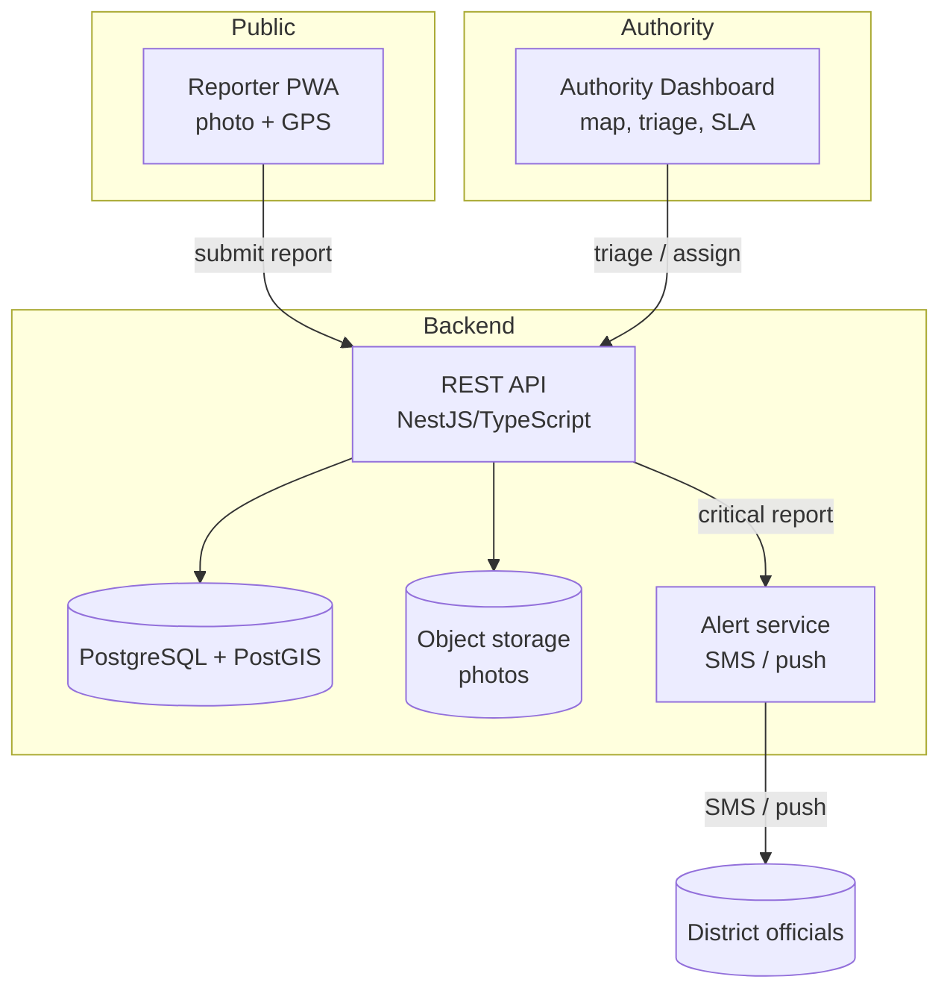
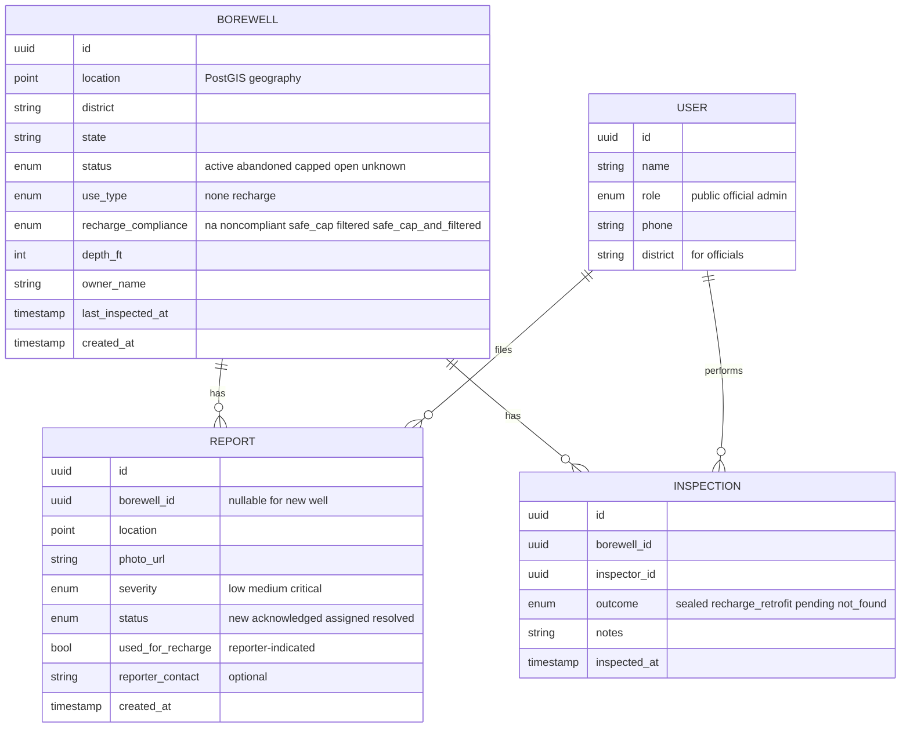
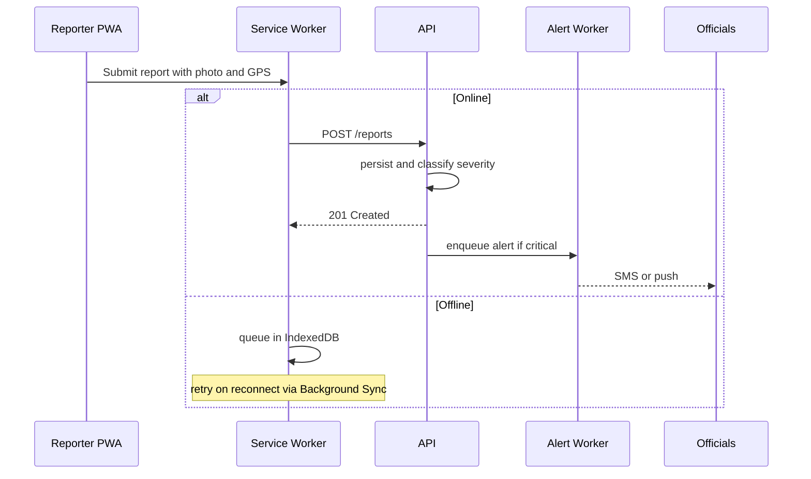

# SafeWell — Planning & Architecture (Phase 1 MVP)

> A borewell-safety platform to prevent children from falling into uncovered borewells,
> speed up detection, and coordinate rescue. This document covers **Phase 1: Registry,
> Public Reporting & Alerting** — the software-first MVP.

---

## 1. Background & motivation

Open and abandoned borewells across India routinely trap young children, leading to
prolonged, dangerous rescues that frequently end in tragedy. A representative case:

- **Ambala, Haryana (Jun 2026):** A 4-year-old (Nirvair Singh) fell into a ~350 ft
  borewell on neighbouring farmland. Initially stuck at ~220 ft, he slipped deeper during
  rescue. Water ingress and rain complicated a 12+ hour multi-agency (NDRF/SDRF/Army)
  operation. The District Commissioner attributed the incident to **negligence — the
  borewell was left uncovered** — and publicly appealed to farmers to cap their wells.
  ([The Tribune](https://www.tribuneindia.com/news/haryana/4-year-old-boy-falls-into-borewell-at-ambala-village-rescue-operation-on/))

The failure chain is consistent across such incidents:

| Stage | What failed | Root cause |
|---|---|---|
| Prevention | Borewell left uncapped after drilling | No enforcement / owner negligence |
| Detection | Fall noticed only when the child screamed | No monitoring on open/abandoned wells |
| Response | 12+ hrs; manual hook & camera; water ingress | No standardized rapid coordination |

Software cannot physically extract a child, but it **can** close the prevention and
enforcement gap, shrink detection-to-dispatch time, and coordinate responders.

### Evidence base

Ambala is not isolated. Documented incidents span at least two decades — from the landmark
2006 **Prince** rescue (Haryana) through **Sujith Wilson** (Tamil Nadu, 2019), **Chetna
Choudhary** (Rajasthan, 2024), and many others — concentrated in Rajasthan, Madhya Pradesh,
Gujarat, Karnataka, Haryana, Punjab, and Tamil Nadu. Indian records indicate ~40 child
borewell deaths between 2009–2019 alone, against an estimated 27 million borewells. Crucially,
**rescue frequently fails even after extraction**, which is why SafeWell prioritises
prevention. A Supreme Court framework (2010) mandating capping and registration exists but is
widely reported as poorly enforced.

See [RESEARCH.md](RESEARCH.md) for the full sourced incident timeline, patterns, and references.

---

## 2. Goals & non-goals

### Phase 1 goals
- Maintain a **geo-tagged registry** of borewells with safety status.
- Let **anyone report an uncovered/abandoned well** in under 60 seconds from a phone.
- Give **local authorities a dashboard** to triage, assign inspections, and track compliance.
- **Alert officials** (SMS/push) when a high-risk report is filed.
- Work in **low-connectivity rural conditions** (offline-first, SMS fallback).

### Non-goals (Phase 1)
- IoT smart-cap hardware and fall detection (Phase 2).
- Live rescue telemetry / responder dispatch automation (Phase 3).
- Predictive hotspot analytics (Phase 4).

### Success metrics
- Time-to-report < 60s; report → authority acknowledgement SLA tracked.
- % of reported open wells inspected/capped within SLA.
- Coverage: number of wells registered per district.

### 2.1 Design constraint — work *with* groundwater recharge, don't fight it

Many "uncovered" borewells are open **on purpose**: farmers remove caps to use dry bores as
**recharge wells**, draining excess monsoon runoff into the aquifer (cheap field drainage +
groundwater replenishment). A solution that simply demands sealing will be defeated the same
way the original caps were — removed. Worse, this practice routes **untreated field runoff
(fertilisers, pesticides, silt, microbes) straight into groundwater**, bypassing natural soil
filtration and risking aquifer pollution.

SafeWell therefore treats prevention as **two compliant states**, not a single "capped" goal:

| Compliant state | Requirement |
|---|---|
| **Sealed** | Locked, load-bearing cap; or filled with mud/sand if permanently abandoned |
| **Safe recharge well** | Child-safe grille/mesh (apertures far smaller than a child's limb) **plus** a recharge structure — silt trap + filter media (gravel → sand → charcoal) before the bore |

Implications:
- The registry records each well's `use_type` and recharge compliance.
- The reporting flow asks whether a well is used for recharge, so authorities **retrofit a
  safe recharge cap + filter** instead of just sealing it.
- **Groundwater quality** becomes a first-class concern (Phase 4).
- This aligns with **Central Ground Water Board (CGWB)** artificial-recharge norms that already
  specify silt traps and filter beds but are seldom followed at the farm level.

---

## 3. Solution overview



---

## 4. Architecture

### 4.1 Components
- **Reporter PWA** — mobile-first, installable, offline-capable. Captures photo + GPS,
  queues submissions when offline, syncs when back online.
- **Authority Dashboard** — map-centric web app for officials: view reports/wells, filter
  by risk, assign inspections, update status, watch SLA timers.
- **API service** — NestJS (TypeScript) REST API; auth, validation, geo queries, alert triggers.
- **Database** — PostgreSQL with PostGIS for spatial queries (nearest wells, district joins).
- **Object storage** — photos (S3-compatible / MinIO for local dev).
- **Alert service** — SMS via an India-friendly provider (MSG91/Twilio) + Firebase push;
  worker-based so delivery retries don't block the request path.

### 4.2 Recommended stack
| Layer | Choice | Why |
|---|---|---|
| API | Node.js + TypeScript (NestJS) | Strong typing, modular, good DX |
| DB | PostgreSQL + PostGIS | First-class geospatial support |
| Frontend | React + Vite + TypeScript | Fast, PWA-friendly |
| Maps | Leaflet + OSM tiles (Mapbox optional) | Open, low cost |
| Offline | Service Worker + IndexedDB queue | Rural connectivity resilience |
| Alerts | MSG91/Twilio SMS + Firebase push | SMS fallback for low data |
| Auth | JWT + role-based (public / official / admin) | Simple, stateless |
| Infra | Docker Compose (dev) → containers (prod) | Portable deployment |

### 4.3 Proposed repository layout (monorepo)
```
SafeWell/
├── docs/                  # planning, architecture, ADRs
├── apps/
│   ├── api/               # NestJS backend
│   ├── reporter-pwa/      # public reporting app
│   └── dashboard/         # authority dashboard
├── packages/
│   └── shared/            # shared TS types, validation schemas
├── infra/                 # docker-compose, db init, deploy configs
└── README.md
```

---

## 5. Data model (initial)



---

## 6. Core API surface (draft)

| Method | Path | Role | Purpose |
|---|---|---|---|
| POST | `/reports` | public | Submit a report (photo + GPS + severity) |
| GET | `/reports` | official | List/filter reports by district, status, severity |
| PATCH | `/reports/:id` | official | Acknowledge / assign / resolve |
| GET | `/borewells?near=lat,lng&radius=` | official | Spatial lookup of nearby wells |
| POST | `/borewells` | official | Register/confirm a well |
| POST | `/inspections` | official | Record an inspection outcome |
| GET | `/stats/district/:id` | official | Compliance & SLA metrics |

Notes:
- Critical reports trigger the alert worker on creation.
- All write endpoints validated via shared schemas (`packages/shared`).

---

## 7. Key flows

### 7.1 Public report (offline-first)


### 7.2 Authority triage
1. Official sees new report on the map, sorted by severity/SLA timer.
2. Acknowledges → assigns an inspector → status moves `new → acknowledged → assigned`.
3. Inspector records the outcome: a non-recharge well is **sealed** (status → `capped`); a
   recharge well gets a **safe recharge cap + filter retrofit** (`use_type = recharge`,
   `recharge_compliance = safe_cap_and_filtered`).

---

## 8. Phase roadmap

| Phase | Deliverable | Outcome |
|---|---|---|
| **0** | Repo + this plan + ADRs + schema | Foundation |
| **1 (MVP)** | Registry + reporting PWA + dashboard + alerts | Prevention/enforcement live |
| **2** | ESP32 smart-cap + fall/intrusion detection over MQTT | Real-time detection |
| **3** | Rescue-coordination + live depth/camera telemetry | Faster, safer rescues |
| **4** | Gov data integration + hotspot prediction + groundwater-quality monitoring for recharge wells | Scale, policy & aquifer protection |

---

## 9. Risks & mitigations

| Risk | Mitigation |
|---|---|
| Low adoption / weak enforcement | Frictionless public reporting; public transparency; gov partnership |
| Rural low connectivity | Offline-first PWA + IndexedDB queue + SMS fallback |
| Spam / false reports | Lightweight reporter verification (OTP), official triage, dedupe by geo proximity |
| Photo storage cost | Compress client-side; lifecycle policies; MinIO in dev |
| Data privacy (reporter contact) | Optional contact, encrypted at rest, role-scoped access |
| Caps removed for recharge use | Promote **child-safe recharge caps + filtration** as the compliant alternative, not blanket sealing |
| Recharge wells polluting groundwater | Require silt trap + filter media; flag recharge wells for water-quality monitoring (Phase 4) |

---

## 10. Immediate next steps

1. Initialize the monorepo layout (`apps/`, `packages/`, `infra/`).
2. Stand up `infra/docker-compose.yml` with Postgres+PostGIS and MinIO.
3. Scaffold the NestJS API with the data model above and `POST /reports`.
4. Scaffold the Reporter PWA (capture photo + GPS, submit, offline queue).
5. Scaffold the Authority Dashboard (map + report list).
6. Wire the alert worker with an SMS provider sandbox.

> When ready to build, start with steps 1–3 (backend + DB) so the data contract is fixed
> before the two frontends consume it.
